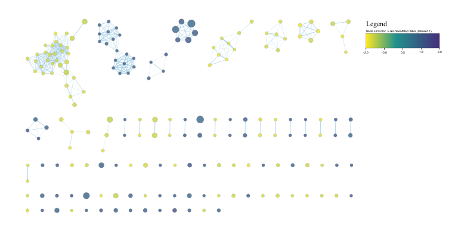
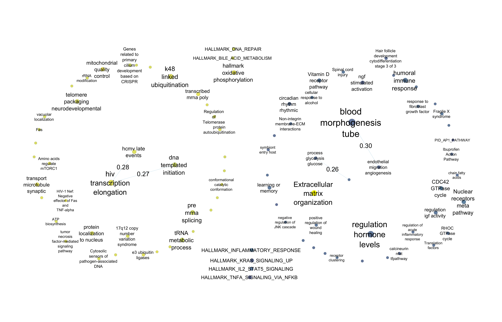
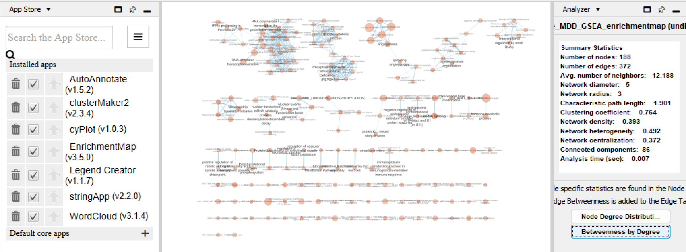

```{r setup, include=FALSE}
knitr::opts_chunk$set(message = FALSE, warning = FALSE)
```

```{r, error=FALSE, results='hide'}
library(GEOquery)
library(edgeR)
library(ggplot2)
library(reshape2)
library(tidyr)
library(tibble)
library(dplyr)
library(biomaRt)
library(knitr)
library(kableExtra)
library(scales)
library(ComplexHeatmap)
if (!requireNamespace("UpSetR", quietly = TRUE))
  install.packages("UpSetR")
library(UpSetR)
if (!requireNamespace("rockchalk", quietly = TRUE))
  install.packages("rockchalk")
library(rockchalk)
if (!requireNamespace("ggrepel", quietly = TRUE))
  install.packages("ggrepel")
library(ggrepel)

if (!requireNamespace("RRHO", quietly = TRUE)){
  BiocManager::install("RRHO")
}
library(RRHO)
library(gprofiler2)
if (!requireNamespace("qusage", quietly = TRUE))
  BiocManager::install("qusage")
if (!requireNamespace("fgsea", quietly = TRUE)){
  BiocManager::install("fgsea")
}
if (!requireNamespace("ggridges", quietly = TRUE))
  install.packages("ggridges")
if (!requireNamespace("DOSE", quietly = TRUE))
  BiocManager::install("DOSE")
library(qusage)
library(DOSE)
library(fgsea)
library(dplyr)
library(stringr)
library(RCy3)
# From Isserlin 2026 (week 5 normalization supp_functions.R)
kable_head <- function(x, n = 5, caption = NULL) {
  knitr::kable(utils::head(x, n), caption = caption)
}
```

# Introduction

At the beginning of the millenium, major depressive disorder (MDD) was the worldwide leading cause of disability [@ustun2004]. With a lifetime prevalence of up to 19%, MDD is twice as common in females than in males [@shorey2022]. Diagnostic symptoms include persistent depressed mood, feelings of guilt or worthlessness, low energy, poor concentration, change in appetite and sleep, and psychomotor retardation [@apa2013]. As MDD prevalence increases year over year, understanding the biological etiology of the complex disorder is more important than ever [@shorey2022]. 

Specifically, the immune system has been shown to exhibit to sex specific disturbances in people with MDD. The paper *Using multiomic integration to improve blood biomarkers of major depressive disorder: a case-control study* [@mokhtari] delves into this topic and uses mRNA, miRNA, and DNA methylation levels to characterize the molecular architecture underlying MDD in a sex stratified approach. We focus on the mRNA data collected as an exercise to see the strength of the transcriptomic signal for MDD in whole blood. 

Pulling from Assignment 1, we saw that sex obscured many MDD specific transcriptomic signals, so we will be working with only the female subset from the study. This is because females account for 105 of the 169 samples in the study, and the original study found poor alignment of female differentially expressed (DE) genes to past meta-analyses on DE genes in blood for MDD.

# Expression Dataset Characteristics

The bulk mRNA-seq data was deposited in the Gene Expression Omnibus (GEO) with accession GSE251778 [@mokhtari]. 

```{r, message=FALSE, warning=FALSE}
gse_id <- "GSE251778"
# retrieve data from GEO
gse <- getGEO(gse_id, GSEMatrix = FALSE)

# extract sex and condition from gsm title
sample_metadata <- sapply(gse@gsms, function(x){
  title <- x@header$title
  characteristics <- strsplit(title, "-")[[1]]
  return(c(paste0("X", characteristics[4], "_rna"), characteristics[4],
           characteristics[2], characteristics[3]))
})

# format metadata dataframe and add some columns to show sex x condition status
sample_metadata <- as.data.frame(t(sample_metadata))
colnames(sample_metadata) <- c("sample_id", "sample_no", "condition", "sex")
sample_metadata$sample_name <- paste(sample_metadata$sample_no, sample_metadata$condition, sample_metadata$sex, sep = "_")
sample_metadata$cond_sex <- paste(sample_metadata$condition, sample_metadata$sex, sep = "_")

```


```{r, message=FALSE, warning=FALSE, results='hide'}
# dataset filenames
sfilenames <- getGEOSuppFiles(gse_id, fetch_files = FALSE)

data_filename <- sfilenames$fname[1]
#data_filename <- "GSE251778_Mokhtari_rna_counts.csv.gz"
download_dir <- file.path(getwd())

# check if the file exists before downloading
if(!file.exists(file.path(download_dir, gse_id, data_filename))){
  sfiles = getGEOSuppFiles(gse_id,
                           baseDir = download_dir, 
                           fetch_files = TRUE)
}

# read in counts csv 
mdd_data <- read.table(
  file.path(download_dir, gse_id, data_filename),
  header=TRUE,
  sep=",")

# clean up dataframe
rownames(mdd_data) <- mdd_data$gene_ID
mdd_data <- mdd_data[, -c(1, 2)]
sample_metadata <- sample_metadata[match(colnames(mdd_data),
                                                sample_metadata$sample_id), ]
colnames(mdd_data) <- sample_metadata$sample_name

# subset to only females
mdd_data <- mdd_data[, grep("_F", colnames(mdd_data))]
# 52237 x 169
dim(mdd_data)
```

The raw data contains 52237 genes across 105 female samples.

## Get Differentially Expressed Genes

```{r}
# load gene id mappings from A1
mapping_df <- readRDS(file = "./A2/ensembl2hgnc.rds")

# edgeR fit = female_fit, normalized data = female_norm,
# contrast = female_contrast, design matrix = female_design from A1
load(file = "./A2/female_dea.rda")

qlf_mddvctrl <- edgeR::glmQLFTest(female_fit, 
                                    contrast = female_contrast)

tags_mddvctrl <- edgeR::topTags(qlf_mddvctrl, n = Inf)$table %>% rownames_to_column("ensembl_gene_id")

# Join mapping onto the edgeR results table
mapped_tab <- tags_mddvctrl %>%
    mutate(ensembl_gene_id = as.character(ensembl_gene_id)) %>%
    left_join(mapping_df, by = "ensembl_gene_id") %>%
    mutate(
      # Use HGNC when available, otherwise fall back to Ensembl
      display_name = ifelse(!is.na(hgnc_symbol) & hgnc_symbol != "",
                            hgnc_symbol,
                            ensembl_gene_id)
    )

```

After differential expression analysis (DEA) using edgeR [@edgeR], there are 171 up-regulated and 490 down-regulated genes in blood of females with vs. without MDD with FDR < 0.05. 

```{r}
knitr::kable(head(mapped_tab[order(mapped_tab$FDR), c(9, 2, 5, 6)], n = 20), caption = "Table 1. Top 20 dysregulated genes in blood of females with vs. without MDD.")

```

# Thresholded over-representation analysis {#threshORA}

We used g:Profiler's GOSt [@gprofiler] to perform our thresholded over-representation analysis. We inputted only DE genes with FDR < 0.05, used only the Gene Ontology: Biological Process (GO:BP)[@GO], WikiPathway (WP)[@WP], and Reactome (REAC)[@REAC] annotation sources, and excluded inferred electronic records. 

```{r}
# use g:profiler, GO:BP

# up and down reg. together
query_updown <- mapped_tab[mapped_tab$FDR < 0.05, "ensembl_gene_id"]
enres_updown <- gost(
  query_updown,
  organism = "hsapiens",
  ordered_query = FALSE,
  multi_query = FALSE,
  significant = TRUE,
  exclude_iea = TRUE,
  measure_underrepresentation = FALSE,
  evcodes = TRUE,
  user_threshold = 0.05,
  correction_method = "fdr",
  domain_scope = "annotated",
  custom_bg = NULL,
  numeric_ns = "",
  sources = c("GO:BP", "REAC", "WP"),
  as_short_link = FALSE,
  highlight = FALSE
)
```


```{r}
# only upreg. genes
query_up <- mapped_tab[mapped_tab$FDR < 0.05 & mapped_tab$logFC > 0, "ensembl_gene_id"]
enres_up <- gost(
  query_up,
  organism = "hsapiens",
  ordered_query = FALSE,
  multi_query = FALSE,
  significant = TRUE,
  exclude_iea = TRUE,
  measure_underrepresentation = FALSE,
  evcodes = TRUE,
  user_threshold = 0.05,
  correction_method = "fdr",
  domain_scope = "annotated",
  custom_bg = NULL,
  numeric_ns = "",
  sources = c("GO:BP", "REAC", "WP"),
  as_short_link = FALSE,
  highlight = FALSE
)

```

```{r}
# only downreg. genes
query_down <- mapped_tab[mapped_tab$FDR < 0.05 & mapped_tab$logFC < 0, "ensembl_gene_id"]
enres_down <- gost(
  query_down,
  organism = "hsapiens",
  ordered_query = FALSE,
  multi_query = FALSE,
  significant = TRUE,
  exclude_iea = TRUE,
  measure_underrepresentation = FALSE,
  evcodes = TRUE,
  user_threshold = 0.05,
  correction_method = "fdr",
  domain_scope = "annotated",
  custom_bg = NULL,
  numeric_ns = "",
  sources = c("GO:BP", "REAC", "WP"),
  as_short_link = FALSE,
  highlight = FALSE
)
```

```{r, eval=FALSE}
get_version_info(organism = "hsapiens")

```

```{r, results='asis'}
updown_tab <- table(enres_updown$result$source)
up_tab <- table(enres_up$result$source)
down_tab <- table(enres_down$result$source)
sources <- c("GO:BP", "REAC", "WP")

gsea_breakdown <- data.frame(source = c("total number of genes", "total number of significant genes", sources, "total terms"), 
"up- and down-regulated" = c(nrow(mapped_tab), length(query_updown), (ifelse(is.na(updown_tab[sources]), 0, updown_tab[sources])), sum(updown_tab)), 
"up-regulated" = c(sum(mapped_tab$logFC > 0), length(query_up), ifelse(is.na(up_tab[sources]), 0, up_tab[sources]), sum(up_tab)),
"down-regulated" = c(sum(mapped_tab$logFC < 0), length(query_down), ifelse(is.na(down_tab[sources]), 0, down_tab[sources]), sum(down_tab)))
rownames(gsea_breakdown) <- 1:6
knitr::kable(gsea_breakdown, caption = "Table 2. Gene counts and annotation source breakdown of significant GSEA results.")
```

The term enrichment for the up-regulated subset of genes only had significant (at FDR = 0.05) hits from the GO:BP source.

```{r, results='asis', fig.cap='Figure 1. UpSet plot of the overlaps between the 3 thresholded enrichments.'}
sig_terms <- list("up- and down-regulated" = enres_updown$result$term_name,
"up-regulated" = enres_up$result$term_name,
"down-regulated" = enres_down$result$term_name)
upset(fromList(sig_terms), 
      nsets = 3, 
      order.by = "freq", 
      mainbar.y.label = "Intersection Size", 
      sets.x.label = "Set Size",
      text.scale = 1.5,
      point.size = 2.5,
      line.size = 1)
```

```{r, eval=FALSE}
# test of significance of overlap of down-reg and up- and down-reg
phyper(38 - 1, 38 + 12, 12, 38 + 6, lower.tail = FALSE)

# 0.07973152
```

The up-regulated thresholded enrichment produces a set of 5 terms that are mutually exclusive from the terms in the down- and generally dysregulated enrichments. While the overlap between the down- and generally dysregulated enrichments is not significant at p = 0.05, it is still notable (p = 0.08). This overlap is likely due to down-regulated genes composing the majority of the significantly dysregulated genes.

## Thresholded Interpretation {#threshORAinter}

```{r}
# heatmap of terms
goenrich_heatmap <- function(enrich_res, top_n = 5, x_label = "Dysregulation", term_source = "GO:BP"){
  # Select top N GO terms per module
  filtered_results <- enrich_res[sapply(enrich_res,
                                        function(x) !is.null(x) && nrow(x$result[x$result$source == term_source,]) > 0)]
  
  plot_data <- lapply(names(filtered_results), function(mod) {
    df <- filtered_results[[mod]]$result
    df <- df[df$source == term_source, ]
    df$Module <- mod
    dplyr::arrange(df, p_value) %>%
      dplyr::slice_head(n = top_n)
  }) %>% dplyr::bind_rows()
  
  # Truncate term names
  plot_data$Term <- stringr::str_trunc(plot_data$term_name, 40)
  plot_data <-  plot_data[!duplicated(plot_data[c("Module","Term")]),]
  
  # Create module x GO term matrix for clustering modules
  mat_df <- plot_data %>%
    dplyr::mutate(logp = -log10(p_value)) %>%
    dplyr::select(Module, Term, logp) %>%
    tidyr::pivot_wider(names_from = Term, values_from = logp, values_fill = 0)
  
  mat <- as.matrix(mat_df[, -1])
  rownames(mat) <- mat_df$Module
  
  # Cluster modules
  row_order <- tryCatch(hclust(dist(mat))$order, error=function(e){seq(along = mat)})
  ordered_modules <- rownames(mat)[row_order]
  plot_data$Module <- factor(plot_data$Module, levels = ordered_modules)
  
  # Plot heatmap with GO terms on y-axis
  ggplot2::ggplot(plot_data, ggplot2::aes(x = Module, y = Term)) +
    ggplot2::geom_tile(ggplot2::aes(fill = -log10(p_value)), color = "white") +
    ggplot2::geom_text(ggplot2::aes(label = intersection_size), size = 3) +
    ggplot2::scale_fill_gradient(low = "white", high = "red", name = "-log10 adj p") +
    ggplot2::labs(x = x_label, y = "Term", title = paste0("Thresholded Enrichment Heatmap ", term_source)) +
    ggplot2::theme_minimal(base_size = 12) +
    ggplot2::theme(axis.text.x = ggplot2::element_text(angle = 45, hjust = 1),
                   axis.text.y = ggplot2::element_text(size = 10),
                   panel.grid = ggplot2::element_blank())
}
```


```{r, results='asis', fig.width=8, fig.cap='Figure 2. Thresholded enrichment heatmap for the 3 enrichments performed in GO:BP. Only the top 5 terms by p-value per enrichment are plotted. The number in the tiles the intersection size between the term and the thresholded input set.'}
goenrich_heatmap(list(up_and_down_regulated = enres_updown,
                      up_regulated = enres_up, 
                      down_regulated = enres_down), 
                 term_source = "GO:BP")
```

There is a general theme of protein ubiquitination across all 3 enrichment sets in GO:BP, with metabolism being prominent in the down- and generally dysregulated enrichments. 

```{r, results='asis', fig.width=8, fig.cap='Figure 3. Thresholded Enrichment Heatmap for the 3 enrichments performed in REAC. All the terms are plotted. The number in the tiles the intersection size between the term and the thresholded input set.'}
goenrich_heatmap(list(up_and_down_regulated = enres_updown,
                      up_regulated = enres_up, 
                      down_regulated = enres_down), 
                 term_source = "REAC", top_n = 10)
```

Again, we see ubiquitination, but we also get transcription related terms as well. The up- and down-regulated set has unique terms relating to nerve growth factor (NGF) and immune responses. Interestingly, major histocompatibility complex (MHC) class I molecules activate cytotoxic responses to intracellular threats, as opposed to external pathogens, suggesting an autoimmune type reaction in MDD [@fu]. As well, the NGF and MHC terms are only significant in the up- and down-regulated set, suggesting that these pathways are neither globally repressed nor activated, but have overall dysregulation in the blood of females with MDD.

```{r, results='asis', fig.width=8, fig.cap='Figure 4. Thresholded Enrichment Heatmap for the 3 enrichments performed in WP. All the terms are plotted. The number in the tiles the intersection size between the term and the thresholded input set.'}
goenrich_heatmap(list(up_and_down_regulated = enres_updown,
                      up_regulated = enres_up, 
                      down_regulated = enres_down), 
                 term_source = "WP")
```

WP only highlights 3q29 copy number variation syndrome, which is a condition that causes significant neurodevelopmental and psychiatric issues, including schizophrenia, autism, and anxiety [@coyan]. This may related to the comorbidity of MDD with other psychiatric conditions.

# Non-thresholded gene set enrichment analysis {#nonthreshORA}

We used fgsea [@fgsea] and the March 2, 2026 human, GO:BP geneset annotation (without inferred electronic records) from the Bader lab [@gmt] to perform our non-thresholded analysis. We specified the minimum set size to be 10, the maximum to be 200, and the number of permutations as 1 000.

```{r}
# rank = -log10(p-value) * sgn(log2FC)
mapped_tab$rank_score <- -log10(mapped_tab$PValue) * sign(mapped_tab$logFC)

rnk_genes <- mapped_tab[order(mapped_tab$rank_score, decreasing = T), ]

rnk_genes_rnk <- rnk_genes$rank_score
names(rnk_genes_rnk) <- rnk_genes$ensembl_gene_id

# no duplicated genes
rnk_genes_rnk <- rnk_genes_rnk[!duplicated(names(rnk_genes_rnk))]
```

```{r}
# download background pathway list
download.file(url = "https://download.baderlab.org/EM_Genesets/March_02_2026/Human/ensembl/Human_GOBP_AllPathways_noPFOCR_no_GO_iea_March_02_2026_ensembl.gmt", destfile = "./A2/Human_GOBP_AllPathways_noPFOCR_no_GO_iea_March_02_2026_ensembl.gmt")
```


```{r}
bg_genes_list <-  suppressMessages(suppressWarnings(read.gmt("./A2/Human_GOBP_AllPathways_noPFOCR_no_GO_iea_March_02_2026_ensembl.gmt")))
bg_gmt_names <- names(bg_genes_list)
names(bg_genes_list) <- sub("%.*", "", names(bg_genes_list))

# 10109 of 29129 are duplicated!
bg_genes_list <- bg_genes_list[!duplicated(names(bg_genes_list))]
fgsea_res <- fgsea(pathways = bg_genes_list, 
                 stats = rnk_genes_rnk,
                 scoreType = 'std', 
                 minSize = 10,
                 maxSize = 200,
                 nproc = 1,
                 nperm = 1000) 

```

None of the pathway enrichments are significant at FDR = 0.05. The minimum FDR is 0.44, for mRNA Splicing (normalized enrichment score (NES) = -1.48).

```{r}
topPathwaysUp <- fgsea_res[NES > 0,][head(order(-NES, pval), n=10), c(1:5, 7)]
topPathwaysDown <- fgsea_res[NES < 0,][head(order(NES, pval), n=10), c(1:5, 7)]

knitr::kable(rbind(topPathwaysUp, (topPathwaysDown[nrow(topPathwaysDown):1, ])), caption = "Table 3. Top 10 up- and down-regulated pathways by NES in females with vs. without MDD.")
```

```{r}

# to select independent-ish pathways

topPathwaysUpCol <- fgsea_res[NES > 0][head(order(pval, decreasing = F), n=10), ]
topPathwaysDownCol <- fgsea_res[NES < 0][head(order(pval, decreasing = T), n=10), ]

collapsedPathwaysUp <- collapsePathways(
  topPathwaysUpCol, bg_genes_list,
  rnk_genes_rnk, pval.threshold = 1)
collapsedPathwaysDown <- collapsePathways(
  topPathwaysDownCol, bg_genes_list,
  -rev(rnk_genes_rnk), pval.threshold = 1)

mainPathways <- fgsea_res[pathway %in% c(collapsedPathwaysUp$mainPathways, collapsedPathwaysDown$mainPathways)][
                         order(-NES), pathway]
```


```{r, results='asis', fig.width=10, fig.cap='Figure 5. Dotplot of the top 10 down-regulated and top 10 up-regulated fgsea terms by NES. FDR is not presented on this plot since nothing is significant at FDR = 0.05.'}
gene_count <- fgsea_res %>% group_by(pathway) %>% summarise(count = sum(str_count(leadingEdge, ",")) + 1)

# merge with the original dataframe
dot_df <- left_join(fgsea_res[fgsea_res$pathway %in% mainPathways][
                         order(-NES), ], gene_count, by = "pathway") %>% mutate(GeneRatio = count/size)
dot_df <- dot_df[order(GeneRatio, decreasing = F), ]
dot_df$pathway_lab <- ifelse(str_length(dot_df$pathway) <= 50, dot_df$pathway, paste0(str_trunc(dot_df$pathway, width = 30), str_trunc(dot_df$pathway, side = "left", width = 20, ellipsis = "")))

# plot
ggplot(dot_df, aes(x = GeneRatio, 
                   y = factor(pathway_lab, levels = dot_df$pathway_lab[order(dot_df$GeneRatio)]))) + 
               geom_point(aes(size = GeneRatio, color = NES)) +
               theme_bw(base_size = 14) +
        scale_color_gradient2(
    low = "blue", 
    mid = "white", 
    high = "red", 
    midpoint = 0
  ) +
        ylab(NULL) + 
        ggtitle("fgsea Pathway Enrichment")
```

From Figure 5, our fgsea highlights activation of several degenerative mechanisms, such as down-regulation of DNA repair, up-regulation of etoposide (a chemotherapy drug that inhibits topoisomerase II) action [@azarova] and peptide elongation. There is also a hormonal theme, with activation of general hormone metabolism and down-regulation of secretion. 

However, we must remember that none of these terms are significant at FDR = 0.05, or any reasonable FDR threshold.

## Visualize in Cytoscape {#cytoscape}

While Figure 5. can summarize some top fgsea enrichments, it does not effectively present the relationship between terms and systematically reduce redundancy.

We used Cytoscape [@shannon] to accomplish these goals. We followed the [Cytoscape automation in R using Rcy3](https://bioconductor.github.io/BiocWorkshops/cytoscape-automation-in-r-using-rcy3.html#use-case-3---functional-enrichment-of-omics-set.) tutorial [@bioconductor].

To start, we must first write our fgsea result to a file.

```{r}
# write GSEA results to a file
em_results <- data.frame(name = bg_gmt_names[match(fgsea_res$pathway, names(bg_genes_list))], descr = fgsea_res$pathway, 
                               pvalue=fgsea_res$pval, qvalue=fgsea_res$padj, NES = fgsea_res$NES, ES = fgsea_res$ES, stringsAsFactors = FALSE)

em_results_filename <-file.path(getwd(),
                            "A2","enr_results.txt")

write.table(em_results,em_results_filename,col.name=TRUE,sep="\t",row.names=FALSE,quote=FALSE)
  
 
```

Then, we performed the following steps locally (outside of the Docker environment) since we didn't want to figure out how to connect to Cytoscape inside Docker. 

```{r, eval=FALSE}
# connect to the running cytoscape session
cytoscapePing()
```

We used RCy3 [@gustavsen] to help automate the network formation process using EnrichmentMap [@merico]. 
```{r, eval=FALSE}
em_results_filename <- file.path(getwd(),
                            "A2","enr_results.txt")
# min q val = 0.43... eek
# choose q val threshold to be 0.6 
em_command <-  paste('enrichmentmap build analysisType="generic" ', "gmtFile=", file.path(getwd(), "A2", "/Human_GOBP_AllPathways_noPFOCR_no_GO_iea_March_02_2026_ensembl.gmt"),
                   'pvalue=',"0.05", 'qvalue=',"0.6",
                   'similaritycutoff=',"0.25",
                   'coeffecients=',"JACCARD",
                   'enrichmentsDataset1=',em_results_filename ,
                   sep=" ")

# get suid of newly created network.
em_network_suid <- commandsRun(em_command)
  
renameNetwork("Female_MDD_GSEA_enrichmentmap", network=as.numeric(em_network_suid))
```

We then used the GUI to colour the nodes by their normalized enrichment score and to add a legend.

```{r, eval=FALSE}
# save preliminary, unsummarized network
png_file_name <- file.path(getwd(),"A2","autonet0.png")

if(file.exists(png_file_name)){
  # must remove file if it already exists
  file.remove(png_file_name)
} 

#export the network image
exportImage(png_file_name, type = "png")
```

```{r, fig.cap="Figure 6. Connectivity of female MDD blood GSEA terms.", fig.width=15}

```

The nodes within each connected graph all have the same enrichment score sign. This indicates that there are consistent gene expression dysregulation patterns underlying each connected graph. There are many singleton terms.

## Summary Network {#summnet}

To further summarize these highly connected nodes, we used AutoAnnotate [@autoann] to create a summary network. We used max words=3, minimum word occurrence=1, and adjacent word bonus from the WordCloud [@wordcloud] app to create summary annotations.

```{r, eval=FALSE}
#get the column from the nodetable and node table
nodetable_colnames <- getTableColumnNames(table="node",  network =  as.numeric(em_network_suid))
all_attr <- getTableColumns(table="node")
descr_attrib <- nodetable_colnames[grep(nodetable_colnames, pattern = "GS_DESCR")]

#Autoannotate the network
autoannotate_url <- paste("autoannotate annotate-clusterBoosted labelColumn=", descr_attrib," maxWords=3 ", sep="")
current_name <- commandsGET(autoannotate_url)
    
  #create a summary network 
commandsGET(paste0("autoannotate summary network=", as.numeric(em_network_suid)))
  
#change the network name
summary_network_suid <- getNetworkSuid()
all_attr_summ <- getTableColumns(table="node")

renameNetwork(title = "Female_MDD_summary_netowrk",
              network = as.numeric(summary_network_suid))

  
#relayout network
layoutNetwork("isom",
              network = as.numeric(summary_network_suid))
```

We then used the GUI to select the nodes with normalized enrichment score < 0 and to apply the Attribute Circle Layout on the selected nodes over the NES. We did the same for the nodes with normalized enrichment score > 0. We also labelled the edges by their similarity coefficients. 

```{r, eval=FALSE}
summary_png_file_name <- file.path(getwd(),"A2","summary_network2.png")
if(file.exists(summary_png_file_name)){
  file.remove(summary_png_file_name)
} 

#export the network
exportImage(summary_png_file_name, type = "png")
save(all_attr, all_attr_summ, file = file.path(getwd(),"A2","network_attr.rda"))
```


```{r, fig.cap="Figure 7. Summary network of female MDD blood GSEA terms. Edges labelled with similarity coefficient.", fig.width=15}

```

The similarity coefficients on the graph edges are all less than 0.3. The connected graphs are also very small, with most terms being summarized as singletons. This suggests that there is poor consistency between summarized networks.

## Non-thresholded interpretation {#nonthreshORAinter}

In Figure 7, there appears to be down-regulation of terms relating to more catabolic processes, such as ATP biosythesis, DNA repair, oxidative phosphorylation, and ubiquitination. Up-regulated summary terms, such as blood morphogenesis tube, humoral immune response, and tumor necrosis factor-alpha signaling, have a general theme of inflammation.

# Discussion {#discussion}

We between out thresholded and non-thresholded analyses, see weak agreement with the original paper and some novel pathway involvements for MDD in blood of females.

Hormonal dysregulation:

The original paper [@mokhtari] highlights up-regulation of specific sterol hormones (corisol, aldosterone, ovarian steroids) in females, whereas our non-thresholded fgsea highlights activation of prostaglandin synthesis and suppression of prolactin activation. The summarized network annotates a hormone regulation group. Our thresholded enrichment also picks up on hormone regulation.

DNA damage:

While not highlighted in the original paper, there are studies on elevated DNA oxidation and DNA repair enzyme expression in brain white matter [@szebeni]. Therefore, similar pathway activation may be present in the blood. However, our network analysis highlights repression of DNA repair. This may reflect either tissue or sex specificity in the biological signatures of MDD (or it could be a spurious association since none of our non-threhsolded enrichments are significant).

Immune activation:

Immune response in female DE genes was not mentioned in the original paper [@mokhtari], but they did mention immune up-regulation in male DE genes. We see mixed directionality in immune related pathways in out analyses. 

Our observed enrichment of ubiquitination terms is likely related to the immune activation aspect of the biological aetiology of MDD. CYLD is a deubiquitinase that removes K63-linked ubiquitin of NF-kappa B essential modulator (NEMO), up-regulates thymocyte progression to T cells, and down-regulates angiogenesis [@yu]. This pathway ties together some of the annotations that pop-up in the thresholded analysis (dysregulation of ubiquitination, up-regulation of T cell activation) and non-thresholded analysis (up-regulation of nuclear factor of activated T cell and angiogenesis). In general, the up-regulation of T cell activation and K63-linked ubiquitin suggests activation of CYLD (which has log2FC = 0.076237510, FDR = 0.40595574 from our DEA from Assignment 1), but the up-regulation of angiogenesis we see is not consistent with this proposed mechanism. This suggests that there is multi-pathway dysfunction occuring in blood of females with MDD. Maldonado-Garcia et al. also report that extracellular monomeric ubiquitin may be a therapeutic option for MDD, and our results may suggest that there are sex and tissue specific considerations to this potential therapy [@maldonado-garcia]. 

## Thresholded over-representation analysis

[1. Which method did you choose and why?](#threshORA)

We used g:Profiler's GOSt [@gprofiler] to perform the thresholded over-representation analysis. This is because GOSt is a well cited method for performing functional enrichment which also has an easy to use R interface.

2. What annotation data did you use and why? What version of the annotation are you using?

We used the Gene Ontology: Biological Process (GO:BP) [@GO], WikiPathways (WP) [@WP], and Reactome (REAC) [@REAC] as annotation data source. This is because they commonly used sources for pathway annotations that are readily available in g:Profiler.

GO:BP version: release 2025-03-16

WP version: 2025-05-10

REAC version: 2025-5-23

3. How many genesets were returned with what thresholds?

For all up- and down-regulated genes significant at FDR = 0.05, g:Profiler's GOSt returned 128 terms significant at FDR = 0.05.

[4. Run the analysis using the up-regulated set of genes, and the down-regulated set of genes separately. How do these results compare to using the whole list (i.e all differentially expressed genes together vs. the up-regulated and down regulated differentially expressed genes separately)?](#threshORAinter)

Since there are only 171 up-regulated differentially expressed genes significant at FDR = 0.05 compared to 490 down-regulated, the thresholded over-representation analysis on the whole list highlights terms more similarly to the down-regulated only analysis compared to the up-regulated. 


### Thresholded over-representation analysis interpretation

5. Do the over-representation results support conclusions or mechanism discussed in the original paper?

The original paper only does transcriptome-wide gene set enrichment analyses (GSEAs) to characterize the pathway enrichments of their differential expression analyses. In females, the original paper highlights terms related to hormone synthesis, such as thyroid/parathyroid, ovarian steroids, aldosterone (NES = 1.84, FDR = 0.03) and cortisol (NES = 1.84, FDR = 0.02), and the glutamatergic synapse (NES = 1.86, FDR = 0.04) [@mokhtari]. We do not see the same hormone oriented term enrichment in our thresholded over-representation analysis. Instead, we see up-regulated enrichment for inflammation-related terms, such as cell motility, regulation of T cell activation, and positive regulation of lymphocyte differentiation. We also see down-regulated enrichment for transcriptional and catabolic terms, such as DNA-templated transcription, nuclear export, and proteasomal protein catabolic process. These findings intersect more strongly with the original paper's male results, which highlight immune responses, such as phagocytosis (NES = 2.14, FDR < 10e−4), and leukocyte transendothelial migration (NES = 1.72, FDR = 1.19 × 10e−2); energy metabolism, including oxidative phosphorylation (NES = 1.81, FDR = 3.81 × 10e−3), and carbon metabolism (NES = 1.82, FDR = 3.99 × 10e−3); and the proteasome (NES = 2.21, FDR < 10−4). However, the direction of these associations between our female results and their male results are flipped for metabolism/proteasomal associations. Therefore, while our female thresholded over-representation analysis results do not highlight the same terms as their female GSEA, our results still support their conclusion of divergent transcriptional signals in males and females with MDD.

[6. Can you find evidence, i.e. publications, to support some of the results that you see. How does this evidence support your results.](#discussion)


## Non-thresholded Gene set Enrichment Analysis

[7. What method did you use? What genesets did you use? Make sure to specify versions and cite your methods.](#nonthreshORA)

We used fgsea (version 1.36.2) [@fgsea] and the March 2, 2026 human, GO:BP geneset annotation (without inferred electronic records) from the Bader lab [@gmt] to perform our non-thresholded analysis.

[8. Summarize your enrichment results.](#nonthreshORA)

None of the enrichment results are significant at FDR = 0.05, or any reasonable FDR threshold.

Based on ES, the fgsea highlights activation of several degenerative mechanisms and a hormonal theme (see the dotplot, Figure 5).


9. How do these results compare to the results from the thresholded analysis in Assignment #2. Compare qualitatively. Is this a straight forward comparison? Why or why not?

There are similarities between the thresholded GO:BP enrichment and the non-thresholded enrichment we performed. They both suggest down-regulation of protein ubiquitination and catabolism. The non-thresholded analysis detects some hormonal dysregulation that is not explicity present in the thresholded analysis (it may be reflected in the macromolecule metabolism term in Figure 2). 

This is not a straight forward comparison because the annotation sources are not exactly the same, the input genesets are not the same, and the fgsea results are not significant.

### Visualize your Gene set Enrichment Analysis in Cytoscape

[10. Create an enrichment map - how many nodes and how many edges in the resulting map? What thresholds were used to create this map? Make sure to record all thresholds. Include a screenshot of your network prior to manual layout.](#cytoscape)

Nodes: 188

Edges: 372

Input term FDR threshold: 0.6

Similarity cutoff: 0.25



[11. Annotate your network - what parameters did you use to annotate the network. If you are using the default parameters make sure to list them as well.](#cytoscape)


[12. Make a publication ready figure - include this figure with proper legends in your notebook.](#cytoscape)

See Figure 6.

[13. Collapse your network to a theme network. What are the major themes present in this analysis? Do they fit with the model? Are there any novel pathways or themes?](#summnet)

See Figure 7. Similarly to question 9, the Cytoscape summarized non-thresholded analysis detects some hormonal dysregulation that is not explicitly present in the thresholded analysis. The summarized network highlights connected networks relating to down-regulated DNA replication, and increased angiogenesis and glycolysis. While angiogenesis is not highlighted in the thresholded analysis, it may be present in the thresholded enrichment of up-regulated genes highlighting cell migration. There is also a general metabolic theme to the thresholded analysis that is refined to up-regulation of glycolysis in the Cytoscape summarized network.

## Interpretation and detailed view of results

[14. Do the enrichment results support conclusions or mechanism discussed in the original paper? How do these results differ from the results you got from Assignment #2 thresholded methods?](#discussion)


[15. Can you find evidence, i.e. publications, to support some of the results that you see. How does this evidence support your result?](#discussion)


# References
